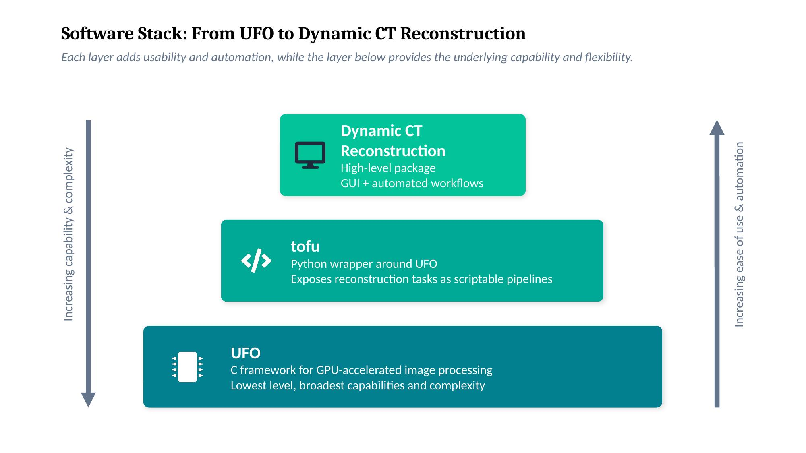
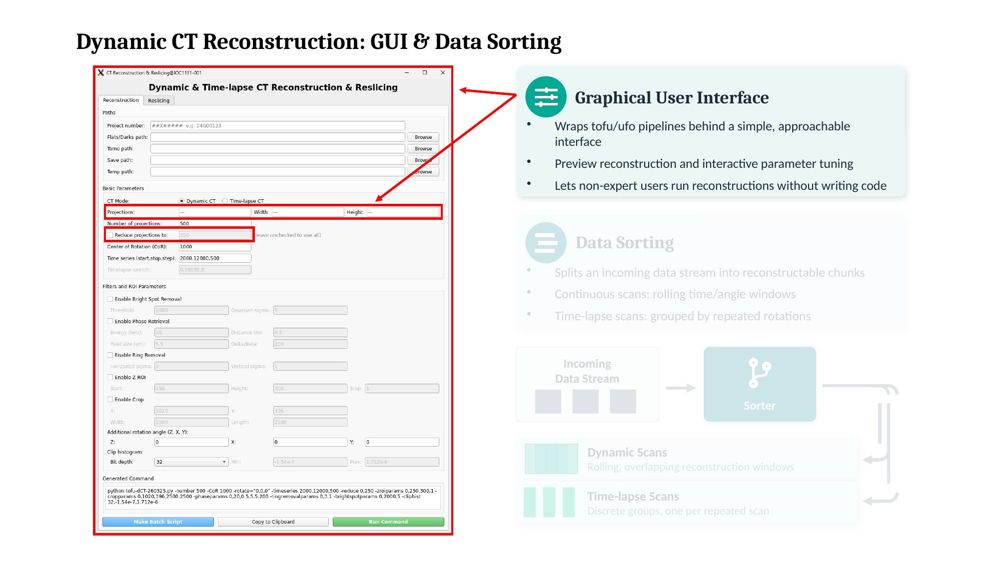
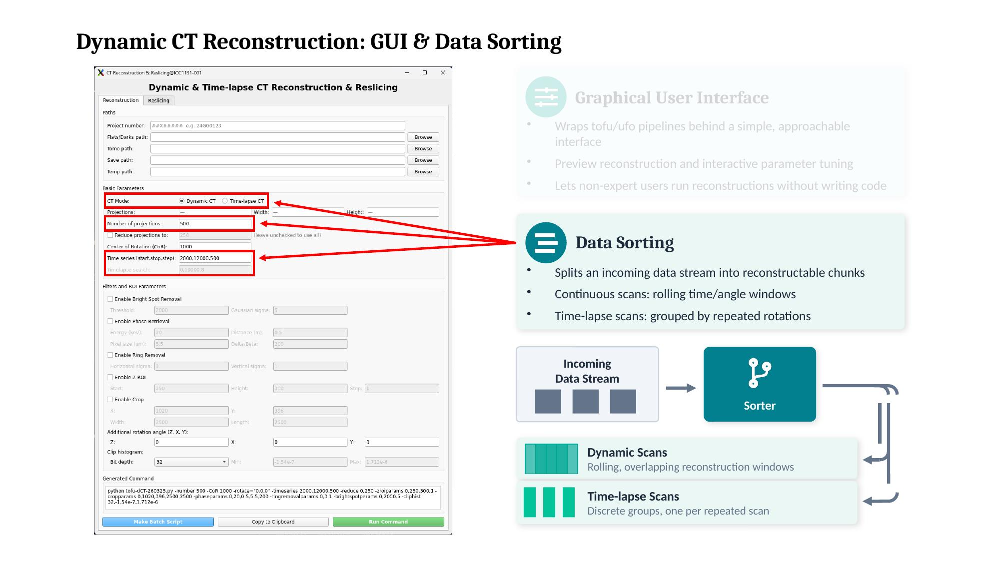
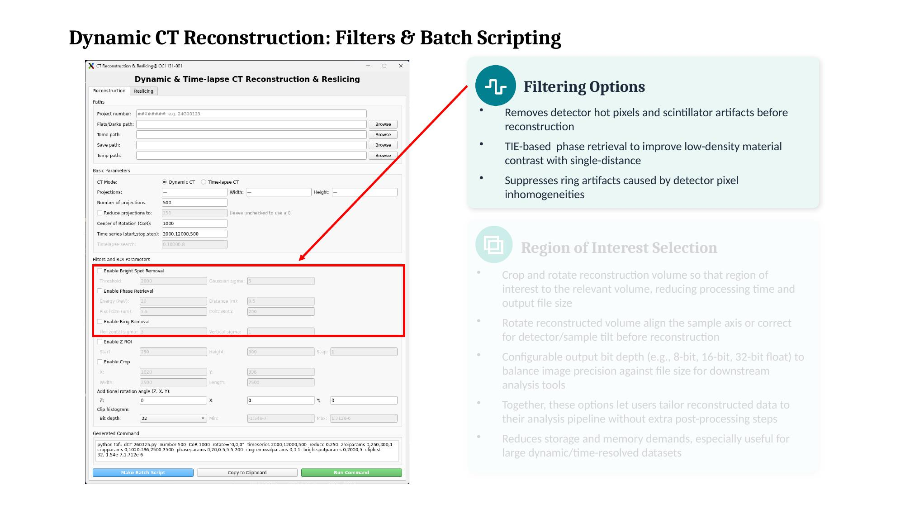
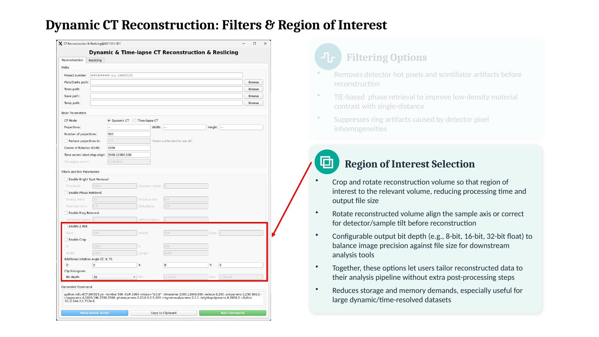
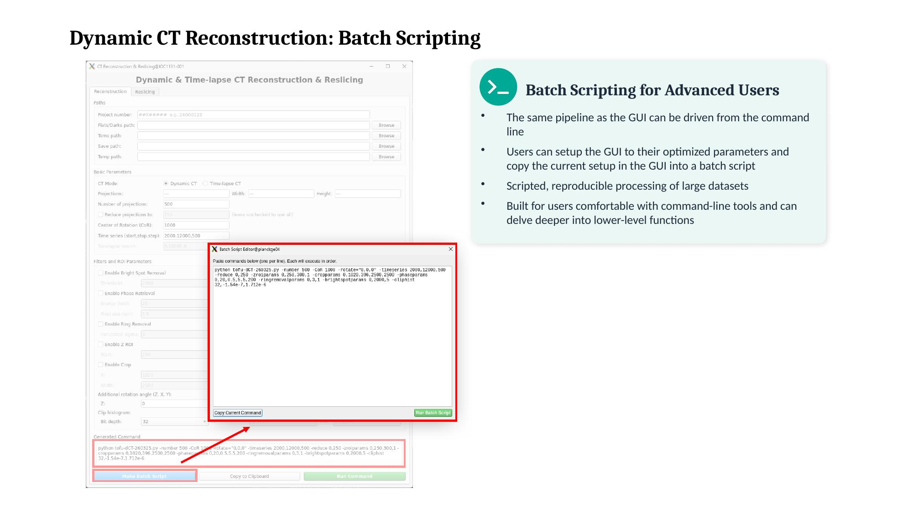

# Dynamic-SRuCT

Scripts for reconstructing and post-processing dynamic (time-resolved) synchrotron
micro-CT data, built around the [ufo-kit / tofu](https://github.com/ufo-kit) reconstruction
toolkit. Originally developed for the dataset described in
[Ding et al., *J. Synchrotron Rad.* (2023), DOI: 10.1107/S1600577523000826](https://doi.org/10.1107/S1600577523000826).

This is the second major version of the codebase — reconstruction is now driven by two
dedicated modes (fixed-interval "dynamic" scans and auto-detected "time-lapse" scans),
center-of-rotation finding is automated, and a PyQt5 GUI (`gui-dynamic.py`) is the
recommended way to build and run commands.

## Requirements

Python dependencies:
```bash
pip install -r requirements.txt
```

You'll also need the [ufo-kit `tofu`/`ufo-launch` toolkit](https://github.com/ufo-kit) installed
and on your `PATH` — this does the actual CT reconstruction, flat-field correction, phase
retrieval, and ring removal, and is not a Python package.

All scripts call each other by filename via `os.system`/`subprocess`, so keep them together
in one working directory (or on `PATH`) — this includes the GUI, which shells out to the
reconstruction and reslicing scripts.

## Quick start: GUI

```bash
python gui-dynamic.py
```

This opens a form for building and launching reconstruction and reslicing commands, so you
don't need to touch the command line for day-to-day use:

- **Reconstruction tab** — pick dynamic or time-lapse mode, set paths, projection count,
  center of rotation (or auto-find it), and toggle phase retrieval / ring removal / bright-spot
  removal / cropping / z-ROI / histogram clipping. The generated command is shown before you
  run it.
- **Reslicing tab** — point at a folder of reconstructed time points and generate XY/XZ/YZ
  views.
- **Batch script editor** — queue up multiple commands (e.g. several samples, or reconstruction
  followed by reslicing) and run them in sequence.

The CLI usage below is what the GUI runs under the hood — reach for it directly for scripting,
automation, or running on a cluster/headless machine without a display.

## Using the GUI

The GUI wraps the `tofu`/UFO reconstruction pipeline behind a simple interface, so you can run
reconstructions without writing code, preview parameters interactively, and hand off to a batch
script once you've settled on a setup. The slides below (from `media/gui-guide/`) walk through
how it fits together.

**1. Where the GUI sits in the stack**

Each layer below adds usability and automation, while the layer underneath provides the
underlying capability and flexibility: UFO (GPU-accelerated image processing, lowest level) →
`tofu` (Python wrapper exposing reconstruction as scriptable pipelines) → this package
(GUI + automated workflows, highest level).



**2. GUI and data sorting**

The GUI wraps the `tofu`/UFO pipelines behind an approachable interface with reconstruction
preview and interactive parameter tuning, so non-expert users can run reconstructions without
writing code. Behind the scenes, the data sorter splits an incoming projection stream into
reconstructable chunks — rolling, overlapping windows for continuous dynamic scans, or discrete
groups for time-lapse scans (one group per repeated rotation).





**3. Filters, region of interest, and output settings**

Filtering options remove detector hot pixels and scintillator artifacts before reconstruction,
apply TIE-based phase retrieval to improve contrast for low-density materials from a single
distance, and suppress ring artifacts from detector pixel inhomogeneities. Region-of-interest
settings let you crop and rotate the reconstruction volume to the relevant region (reducing
processing time and output size), correct for detector/sample tilt, and choose an output bit
depth (8-bit, 16-bit, or 32-bit float) to balance precision against file size — useful for
keeping storage and memory demands manageable on large dynamic/time-resolved datasets.





**4. Batch scripting for advanced users**

The same pipeline the GUI drives can also be run from the command line. Once you've tuned
parameters in the GUI, you can copy that setup directly into a batch script for scripted,
reproducible processing of large datasets — useful once you're comfortable with the underlying
command-line tools and want to work with the lower-level functions directly.



## What's here

| Script | Purpose |
|---|---|
| `gui-dynamic.py` | PyQt5 desktop app for building `tofu-dCT.py` / `tofu-tlCT.py` / `reslice.py` commands interactively, plus a batch script editor for queuing and running multiple commands in sequence. **Recommended entry point.** |
| `tofu-dCT.py` | Main reconstruction wrapper. Splits a raw projection stream into fixed-interval time points and reconstructs each with `tofu`/`ufo-launch` (flat-field correction, optional bright-spot removal, optional phase retrieval, optional ring removal, cropping/ROI, histogram clipping). |
| `tofu-tlCT.py` | For scans where 180°-scan boundaries drift or aren't evenly spaced in time. Auto-detects each scan's start/stop by correlating projections, then calls `tofu-dCT.py` once per detected scan. |
| `find-center.py` | Finds the center of rotation by correlating the 0° and 180° projections (sub-pixel, via parabolic fit around the minimum). For standard single-page TIFF stacks. |
| `find-center-bigtif.py` | Same as above, for data stored as BigTIFF / multi-page TIFF files. |
| `reslice.py` | Generates XY, XZ, and YZ resliced views across a folder of reconstructed time-point volumes, with resume support (skips already-processed time points) and optional 180° flip correction for time-lapse scans. |
| `utils.py` | Shared helper functions used across the above (subfolder splitting with/without binning, grey-value histogram bounds, ellipse mask generation, scan-boundary search, progress bar). |
| `imagej-save-polygon-array.txt` | ImageJ macro snippet for exporting polygon ROI coordinates (e.g. for tracking a region across slices/time points) to a flat array. |

## CLI usage

1. **Reconstruct.**
   - If your scan has a fixed, known number of projections per 180° rotation and evenly spaced
     time points, use `tofu-dCT.py` directly.
   - If scan boundaries vary or need to be detected automatically, use `tofu-tlCT.py`,
     which finds each scan's boundaries and calls `tofu-dCT.py` for you.
   - Either script can call `find-center.py` / `find-center-bigtif.py` automatically with
     `-findCoR`, or you can run those separately first and pass `-CoR` explicitly.
2. **Reslice.** Run `reslice.py` on the output folder to generate XY/XZ/YZ views across all
   time points.

### Example: dynamic CT (fixed time points)

```bash
python tofu-dCT.py \
  -flatsdarks /data/raw/sample1 \
  -tomo /data/raw/sample1/tomo \
  -SAVE /data/rec/sample1 \
  -TEMP /data/tmp/sample1 \
  -number 1000 \
  -timeseries 0,7000,250 \
  -findCoR \
  -phaseparams 1,30,0.45,5,2000 \
  -ringremovalparams 1,3,1 \
  -brightspotparams 1,2000,5 \
  -cliphist 8,-0.0002,-0.0001 \
  -zroiparams 1,300,200,20 \
  -cropparams 1,1232,656,2000,2000
```

### Example: time-lapse CT (auto-detected scan boundaries)

```bash
python tofu-tlCT.py \
  -flatsdarks /data/raw/sample1 \
  -tomo /data/raw/sample1/tomo \
  -SAVE /data/rec/sample1 \
  -TEMP /data/tmp/sample1 \
  -number 500 \
  -timelapsesearch 0,2500,8 \
  -findCoR \
  -phaseparams 1,20,0.5,5.5,200 \
  -cliphist 8,-0.0008,-0.0003 \
  -zroiparams 1,160,500,50 \
  -cropparams 1,500,500,1000,1000
```

### Example: reslicing

```bash
python reslice.py -PATH /data/rec/sample1 -XYsli 1,450 -XZsli 1,1200 -YZsli 0,1200 -mode 0
```

Run any script with `-h` for the full list of arguments and defaults.

## Notes

- `find-center.py`, `find-center-bigtif.py`, `reslice.py`, and `gui-dynamic.py`
  invoke each other and `tofu-dCT.py` / `tofu-tlCT.py` by filename via
  `os.system`/`subprocess`, so all scripts should stay in the same working directory (or on
  `PATH`) when running.
- Both bigtiff/multi-page TIFF stacks and folders of single-page TIFFs are supported for the
  raw projection input.
- This version does not include standalone raw-data housekeeping scripts (deleting scanner
  junk files, splitting raw projections into per-time-point subfolders ahead of time, moving
  reconstructed slices out of `tofu`'s output subfolders) — subfolder splitting is now handled
  internally by `tofu-dCT.py`. If you still need the old housekeeping scripts, they're
  available in the version history.

## Citation

If you use this code, please cite:

Ding, X. et al. (2023). *J. Synchrotron Rad.* DOI: [10.1107/S1600577523000826](https://doi.org/10.1107/S1600577523000826)

Works that have used these scripts include:

Danalou, S. et al. (2022). *Int. J. Pharm.* DOI: [10.1016/j.ijpharm.2022.122192](https://doi.org/10.1016/j.ijpharm.2022.122192)

Danalou, S. et al. (2023). *AIChE J.* DOI: [10.1002/aic.18048](https://doi.org/10.1002/aic.18048)

Blocka, C. et al. (2024). *Int. J. Pharm.* DOI: [10.1016/j.ijpharm.2024.124664](https://doi.org/10.1016/j.ijpharm.2024.124664)

Kalugin, D. et al. (2026). *J. Pharm. Sci.* DOI: [10.1016/j.xphs.2026.104226](https://doi.org/10.1016/j.xphs.2026.104226)
